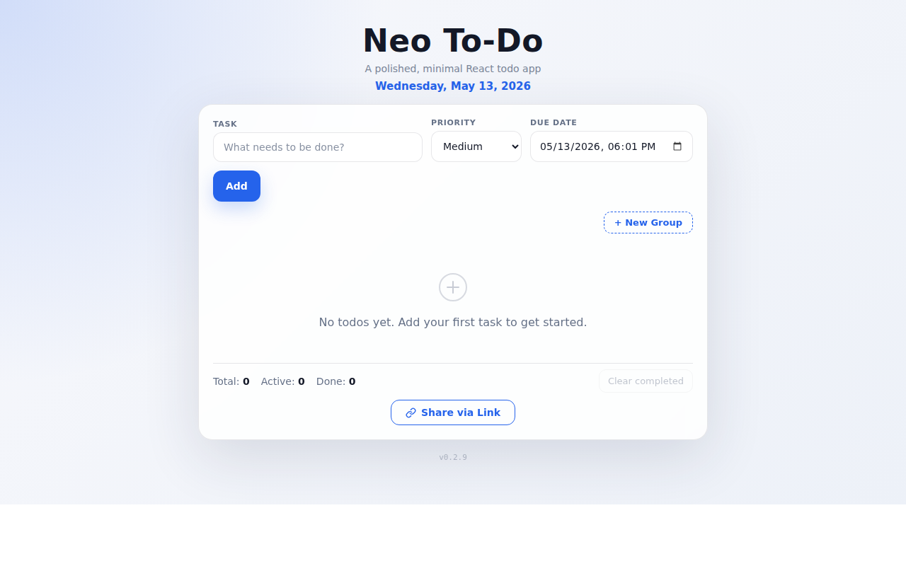
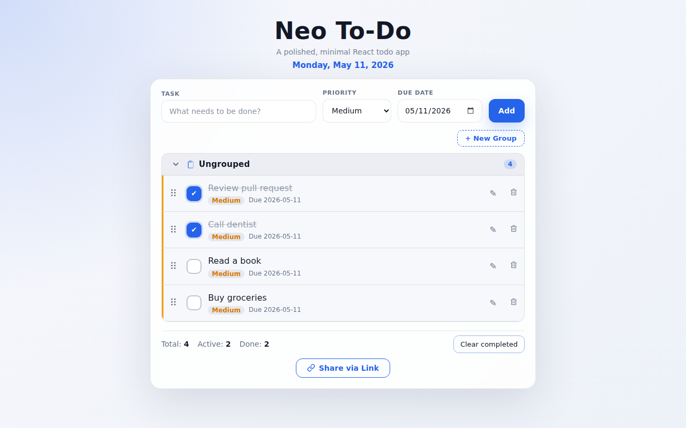

# Neo To-Do

Neo To-Do is a polished, minimal React todo app built with Vite. It persists tasks and groups in `localStorage`, supports shareable links, and provides a clean, responsive UI for desktop and mobile.

**Live app:** https://neo-todo-peach.vercel.app/

**Current release:** v0.2.7

## Features

- Add todos with the **Add** button or by pressing **Enter**
- Mark tasks complete/incomplete from the checkbox-style toggle or task text
- Edit todo text inline
- Add **due date + time** and low/medium/high priority when creating a task
- Due date field uses `datetime-local` — pick both date and time in one step
- **Click the priority badge on any task** to cycle through none → Low → Med → High inline
- **Click the due date on any task** to edit it inline (Safari-safe, shows full datetime picker)
- Time displayed on its own line below the date in accent colour for easy scanning
- Delete individual todos with undo support
- Clear all completed todos in one click with undo support
- Inline empty state when there are no tasks or groups
- Stats bar for total, active, and completed tasks
- Today's formatted date displayed in the header
- Create custom task groups with **+ New Group**
- Rename or delete groups; deleted-group tasks move back to **Ungrouped**
- Assign new tasks directly to a selected group from the add-task row
- View tasks in collapsible group sections with animated chevrons
- Keep unassigned tasks in the built-in **Ungrouped** section
- **Per-group sort toggle** — each group header has independent **↑ Oldest first** / **↓ Latest first** buttons to sort tasks by due date; groups can be sorted differently from each other
- Drag and drop tasks to reorder within a group
- Drag and drop tasks between groups, including the **Ungrouped** section
- Pointer, touch, and keyboard drag support via `@dnd-kit`
- **Compact drag ghost** centered under the cursor — shows task name, priority dot, and due date for context while reordering
- Persist todos to `localStorage` under `neo_todo.todos`
- Persist groups to `localStorage` under `neo_todo.groups`
- **Share via Link** — encodes todos and groups into a compressed, shortened URL through a TinyURL serverless proxy
  - Uses `lz-string` compression in the URL hash so shared todo state does not hit the server
  - Uses the Web Share API when available and falls back to clipboard copy or a manual-copy URL field
  - Falls back to the full compressed URL if TinyURL is unavailable
- Installable/offline-capable PWA via `vite-plugin-pwa`
- Accessible labels and keyboard-friendly controls
- Minimal UI dependencies — no component library
- Responsive UI with a clean, contemporary look
- Adapts to OS color scheme: light by default, dark in dark mode

## Screenshots

### Empty state



### Todo list with tasks



## Tech stack

- React 19
- Vite 8
- `@dnd-kit/core`, `@dnd-kit/sortable`, and `@dnd-kit/utilities` for drag-and-drop sorting and cross-group moves
- `lz-string` for compact share-link payloads
- Vercel serverless function for TinyURL shortening
- `vite-plugin-pwa` for installable/offline support
- CSS custom properties for responsive light/dark theming
- Node's built-in test runner for utility tests
- ESLint for code quality
- GitHub Actions for CI
- Vercel for hosting

## Architecture

```text
.github/workflows/
  ci.yml                      # GitHub Actions: test, lint, build
api/
  shorten.js                  # Vercel serverless TinyURL proxy with URL allow-listing
src/
  App.jsx                     # Main todo/group state, persistence, sharing, and drag/drop orchestration
  dateFormatter.js            # Formats the header day/date label
  components/
    GroupSection.jsx          # Droppable, collapsible/renamable group sections with per-group sort
    ShareButton.jsx           # Share-link creation, Web Share API, clipboard, and manual fallback
    SortableTodoItem.jsx      # Draggable/sortable editable todo row powered by @dnd-kit
    Stats.jsx                 # Total / active / completed counters
  utils/
    dateInput.js              # datetime-local value helper (local-timezone aware)
    shareUrl.js               # Encode/decode todo+group state to/from URL hash
    storage.js                # Safe localStorage read/write helpers
    todoState.js              # State validation, normalization, and ID helpers
tests/
  dateFormatter.test.js       # Date-formatting coverage
  dateInput.test.js           # Date input value helper coverage
  shareUrl.test.js            # Share payload coverage
  shorten.test.js             # Shortener API validation coverage
  todoState.test.js           # State normalizer coverage
```

## Getting started

Prerequisites:

- Node.js 24+
- npm

Install dependencies:

```bash
npm install
```

Start the development server:

```bash
npm run dev
```

Run tests:

```bash
npm test
```

Run linting:

```bash
npm run lint
```

Build for production:

```bash
npm run build
```

Preview the production build locally:

```bash
npm run preview
```

## CI

GitHub Actions runs on pushes and pull requests to `main`:

```bash
npm ci
npm test
npm run lint
npm run build
```

## Deployment

Neo To-Do is hosted on Vercel:

https://neo-todo-peach.vercel.app/

Production builds are generated with:

```bash
npm run build
```

The `api/shorten.js` serverless function is deployed automatically by Vercel alongside the static build.

## Changelog

See [CHANGELOG.md](CHANGELOG.md) for the full release history.

## Notes

- Core todo and group management is fully client-side and does not require a backend.
- Todos and groups are saved only in the current browser/profile through `localStorage`.
- The date header uses `Intl.DateTimeFormat`, so output follows the user's runtime locale by default.
- Due date+time uses `hour12: true` so AM/PM is always shown regardless of OS locale.
- The share URL API (`/api/shorten`) requires Vercel or another compatible serverless environment.
- The shortener endpoint only accepts app share URLs to avoid becoming a public open-shortener proxy.
